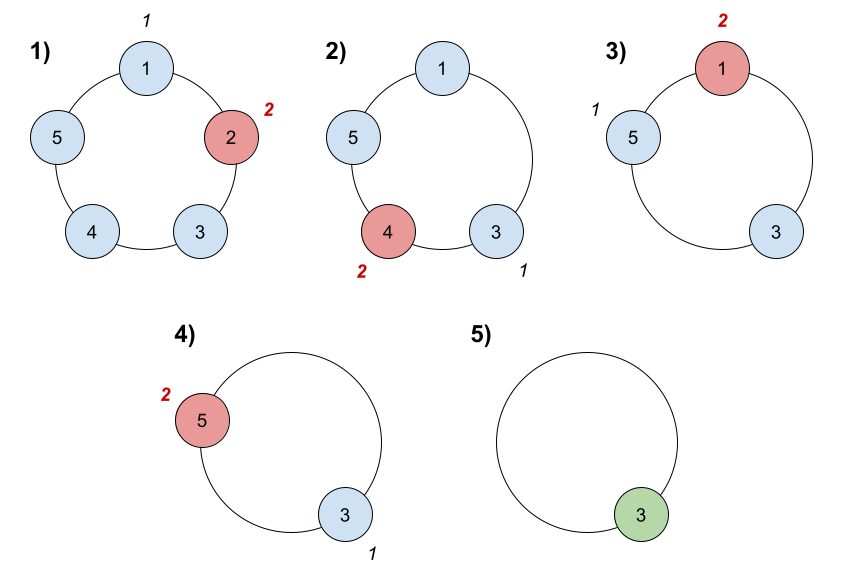

# Problem 3: Last Building Standing

In Atlantis, buildings are arranged in concentric circles. The Greek gods have become unhappy with Atlantis, and have decided to punish the city by sending floods to sink certain buildings into the ocean. 

Assume there are `n` buildings in a circle numbered from `1` to `n` in clockwise order. More formally, moving clockwise from the `ith` building brings you the the `(i+1)th` building for `1 <= i < n`, and moving clockwise from the `nth` building brings you to the `1st` building. 

The gods are sinking buildings as follows:

1. Start with the `1st` building.
2. Count the next `k` buildings in the clockwise direction **including** the building you started at. The counting wraps around the circle and may count some buildings more than once.
3. The last building counted sinks and is removed from the circle.
4. If there is still more than one building standing in the circle, go back to step `2`  **starting** from the building **immediately clockwise** of the building that was just sunk and repeat.
5. Otherwise, return the last building standing. 

Evaluate the time and space complexity of your solution. Define your variables and provide a rationale for why you believe your solution has the stated time and space complexity.

```python
def find_last_building(n, k):
    pass
```

Example Usage:



```python
print(find_last_building(5, 2))
print(find_last_building(6, 5))
```

Example Output:

```markdown
3
Example 1 Explanation: 
1) Start at building 1.
2) Count 2 buildings clockwise, which are buildings 1 and 2.
3) Building 2 sinks. Next start is building 3.
4) Count 2 buildings clockwise, which are buildings 3 and 4.
5) Building 4 sinks. Next start is building 5.
6) Count 2 buildings clockwise, which are buildings 5 and 1.
7) Building 1 sinks. Next start is building 3.
8) Count 2 buildings clockwise, which are buildings 3 and 5.
9) Building 5 sinks. Only building 3 is left, so they are the last building standing.

1
Example 2 Explanation: 
Buildings sink in this order: 5, 4, 6, 2, 3. The last building is building 1. 
```
