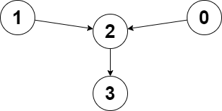
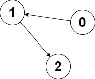

# Problem 5: Find Closest Node to Two Other Nodes

You are given a directed graph of `n` nodes numbered from `0` to `n - 1`, where each node has at most one outgoing edge.

The graph is represented with a given 0-indexed array `edges` of size `n`, indicating that there is a directed edge from node `i` to node `edges[i]`. If there is no outgoing edge from `i`, then `edges[i] == -1`.

You are also given two integers `node1` and `node2`.

Return the index of the node that can be reached from both `node1` and `node2`, such that the maximum between the distance from `node1` to that node, and from `node2` to that node is minimized. If there are multiple answers, return the node with the smallest index, and if no possible answer exists, return `-1`.

Note that `edges` may contain cycles.

```python
def closest_meeting_node(edges, node1, node2):
    pass
```

Example Usage 1:



```python
edges_1 = [2,2,3,-1]

print(closest_meeting_node(edges_1, 0, 1))
```

Example Output 1:

```markdown
2
Example 1 Explanation: The distance from node 0 to node 2 is 1, and the distance from node 1
to node 2 is 1.
The maximum of those two distances is 1. It can be proven that we cannot get a node with a
smaller maximum distance than 1, so we return node 2.
```

Example Usage 2:



```python
edges_2 = [1,2,-1]

print(closest_meeting_node(edges_1, 0, 2))
```

Example Output 2:

```markdown
2
Example 2 Explanation: The distance from node 0 to node 2 is 2, and the distance from node 2 to
itself is 0.
The maximum of those two distances is 2. It can be proven that we cannot get a node with a smaller
maximum distance than 2, so we return node 2.
```
