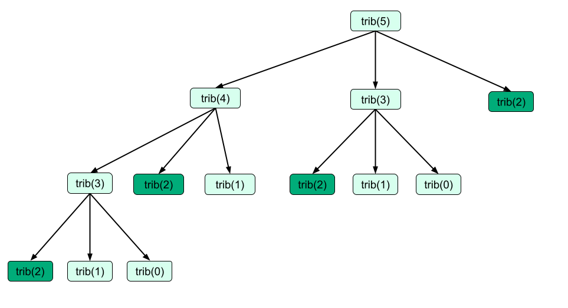

## Unit 12 Cheatsheet

Here’s a quick reference sheet for Unit 12. While not an exhaustive list, it highlights the key syntax and concepts you’ll use in this unit, plus a few optional ideas that may help with problem-solving. You’re still expected to know required material from earlier units.

Sections are labeled for clarity:

- ✅ In-Scope: May appear on the assessment
- 💡 Not In-Scope: Useful, but not required

General Concepts ✅ In-Scope

### Dynamic Programming

Dynamic programming (dynamic programming) is a problem solving technique used to optimize solutions by storing the results of subproblems. This prevents recalculating the same values repeatedly, making the solution more efficient. When we see a problem whose solution involves repeatedly solving the same subproblem, dynamic programming can be used to optimize the solution.

At its core, dynamic programming is about breaking down a problem into smaller, simpler subproblems, solving those subproblems once, and storing their results. Then, instead of solving each subproblem multiple times, we reuse previously computed answers.

As software engineer [Jonathan Paulson put it on Quora](https://www.quora.com/How-should-I-explain-dynamic-programming-to-a-4-year-old/answer/Jonathan-Paulson), dynamic programming is just a fancy term for asking the computer to remember what it has already calculated:

```text
*writes down "11111111" on a sheet of paper*
"How many 1s are there?"
*counting* "Eight!"
*writes down another "1"*
"How about now?"
*quickly* "Nine!"
"How'd you know it was nine so fast?"
"You just wrote one more"
"So you didn't need to recount because you remembered there were eight!
  Dynamic programming is just a fancy way to say:
  'remembering stuff to save time later'"
```

#### 1-D Dynamic Programming

In 1-dimensional dynamic programming problems, the problem can be broken down into subproblems that depend on one variable. We store the answers to each subproblem using a 1-D array - that is to say, we store the answers in a list.

Dynamic programming solutions have four key components:

1.  **State (Subproblem Definition)**: The state represents the subproblem we are solving at a specific index or value. In 1-D dynamic programming, this is usually stored in a list, usually named `dp` or `memo` by convention, where each index corresponds to a specific subproblem.
2.  **Recurrence Relation (Transition)**: The recurrence relation describes how the solution to a larger subproblem is constructed from smaller subproblems. This defines the transition between states. This is equivalent to the recursive case in a recursive solution.
3.  **Base Case (Initial Conditions)**: As with recursion, the base case represents the simplest subproblem, which doesn’t depend on any previous results. This is the starting point from which the dynamic programming list is filled.
4.  **Final Solution**: The solution to the overall problem (i.e., the largest subproblem) is typically stored at the last index of the array.

We can look at an example of this using the Tribonacci sequence. Similar to the Fibonacci sequence, The `nth` Tribonacci number is the sum of the previous three numbers in the sequence. The mathematical sequence is defined as follows:

- `T``0`` = 0`
- `T``1`` = 1`
- `T``2`` = 1`
- `T``n+3`` = T``n`` + T``n+1`` + T``n+2` for `n >= 0`.

The non-optimal recursive solution to find the `nth` Tribonacci number is as follows:

```python
def tribonacci_recursive(n):
    # Base cases
    if n == 0:
        return 0
    elif n == 1 or n == 2:
        return 1
    
    # Recursive relation
    return tribonacci_recursive(n - 1) + tribonacci_recursive(n - 2) + tribonacci_recursive(n - 3)
```

To get the `nth` Tribonacci number we need to find the solution to the `n-1th` number, `n-2th` number and the `n-3`th number. Each of these is a subproblem.

The recursive solution is inefficient because it repeatedly solves some of the same subproblems. For example, for the

This solution is inefficent because we repeatedly solve the same subproblems. For example, notice that to find the 5th Tribonacci number `tribonacci_recursive(5)`, we make the function call `tribonacci_recursive(2)` four separate times.



To eliminate the need for repeated recursive calls on the same problem, we can instead create an array to **memoize** or store the results to smaller subproblems as we encounter them.

We can define the four components to a dynamic programming solution for Tribonacci as follows:

1.  State: `dp[i]` represents the `ith` Tribonacci number.
2.  Recurrence Relation: `dp[i] = dp[i-1] + dp[i-2] + dp[i-3]` for `i≥3i≥3`.
3.  Base Case: `dp[0] = 0`, `dp[1] = 1`, `dp[2] = 1`.
4.  Final Solution: The final answer is stored in `dp[n]`, where n is the desired Tribonacci number.

To find the `nth` Tribonacci number `T``n`, we will need to find Tribonacci numbers `T``0``, T``1``,...,T``n-1` so we create an array of length `n+1` (`n` numbers plus the `0th` number) and temporarily initialize each value to `0` to start. The value at each index `dp[i]` will represent the `nth` Tribonacci number.

Then we begin by solving the smallest subproblems, the base cases. We replace the initial starter value of `0` in the `dp` array with their actual Tribonacci values. Then we use the base cases to start solving larger and larger subproblems. For each `dp[i]`, instead of using recursive calls to determine what the value should be, we can just look inside the `dp` array to quickly calculate its value in `O(1)` time. Once we've found the `nth` number, we return `dp[n]`.

```python
def tribonacci_dp(n):
    # Base cases for n = 0, 1, 2
    if n == 0:
        return 0
    elif n == 1 or n == 2:
        return 1
    
    # Create a dynamic programming array to store tribonacci numbers up to n
    dp = [0] * (n + 1)
    dp[1] = dp[2] = 1
    
    # Fill the dp array using the recurrence relation
    for i in range(3, n + 1):
        dp[i] = dp[i - 1] + dp[i - 2] + dp[i - 3]
    
    # Return the nth tribonacci number
    return dp[n]
```

Dynamic programming solutions are often iterative, solving the smallest problems first, and filling up the `dp` array incrementally. This is known as a bottom-up approach.

However, dynamic programming can also be done using a recursive approach by passing in the `dp` array along in each recursive call. This often requires a helper function.

```python
def tribonacci_recursive_dp(n):
    # Initialize the list to store computed tribonacci numbers
    dp = []

    # Helper recursive function
    def helper(i):
        # Base cases
        if i == 0:
            dp.append(0)
        elif i == 1 or i == 2:
            dp.append(1)
        else:
            # Recursively compute and append only if it doesn't exist
            if i >= len(dp):
                dp.append(helper(i - 1) + helper(i - 2) + helper(i - 3))
        return dp[i]

    # Start the recursion
    return helper(n)
```

  

Advanced Concepts ✅ In-Scope

#### 2-D Dynamic Programming

For more complex problems where the answer depends on two parameters, we can use 2-dimensional dynamic programming. As its name suggests, with 2-D dynamic programming we use a 2-dimensional array or memo to store the results of subproblems. We commonly use this approach when we are working with grids, matrices, or comparing two sequences such as two strings.

We can revise the components of a dynamic programming solution for 2-D as follows:

1.  **State**: In 2-D dynamic programming, the state is defined by two parameters, typically represented as `dp[i][j]`. This can represent different things depending on the problem, such as:

    - A grid cell's value.
    - The optimal solution up to two points in sequences.

2.  **Transition/Recurrence Relation**: This defines how the solution to a subproblem (`dp[i][j]`) relates to the solutions of smaller subproblems, often based on previously solved values in the table.

3.  **Base Case**: The initial values for some cells in the dynamic programming table are known from the start (e.g., the top row or the leftmost column).

4.  **Final Solution**: After filling out the dynamic programming table, the final solution to the problem can be found in one of the cells, typically `dp[m][n]`, which stores the answer for the entire problem.

We can take a closer look at 2-D dynamic programming with an example problem: the 0/1 Knapsack Problem.

In the 0/1 Knapsack problem are given:

- A set of `n` items, each with a weight and a value.
- A knapsack that can carry a maximum weight `W`.

You need to determine the **maximum value** you can carry in the knapsack without exceeding the weight limit. You can either **include or exclude** each item (hence "0/1" – you can't take a fraction of an item).

From the problem statement, we can define the following:

- **State**: We define the state `dp[i][w]` to represent the **maximum value** we can obtain by considering the first `i` items and a knapsack of capacity `w`.
- **Decision**: For each item, you can either **include** it in the knapsack (if it fits) or **exclude** it. The decision affects the subproblem solutions.
- **Base Case**: If there are no items or the knapsack has no capacity, the maximum value is 0.

Now we can start to plan our approach:

1.  **State**:

    - `dp[i][w]` represents the maximum value we can obtain using the first `i` items and a knapsack with a weight limit of `w`.

2.  **Recurrence Relation**:

    - For each item `i`, you have two choices:
      1.  **Exclude the item**: In this case, the value is the same as without this item: `dp[i-1][w]`.
      2.  **Include the item**: If you include the item, you gain its value, but the remaining capacity of the knapsack is reduced by its weight. The new value will be `value[i-1] + dp[i-1][w - weight[i-1]]` (you get the value of the item plus the best solution for the reduced capacity).

    So, the recurrence relation becomes: `dp[i][w] = max(dp[i-1][w], value[i-1] + dp[i-1][w - weight[i-1]])`

    You only include the item if its weight is less than or equal to the current knapsack capacity `w`.

3.  **Base Case**:

    - If there are no items (`i == 0`), then `dp[0][w] = 0` for any capacity `w`.
    - If the capacity is 0 (`w == 0`), then `dp[i][0] = 0` for any number of items.

We can implement the solution as follows:

```python
def knapsack_01(weights, values, W):
    n = len(weights)
    
    # Create a DP table where dp[i][w] represents the maximum value for the first i items and capacity w
    dp = [[0] * (W + 1) for _ in range(n + 1)]

    # Fill the DP table
    for i in range(1, n + 1):
        for w in range(1, W + 1):
            if weights[i - 1] <= w:  # If the current item can be included
                dp[i][w] = max(dp[i - 1][w], values[i - 1] + dp[i - 1][w - weights[i - 1]])
            else:
                dp[i][w] = dp[i - 1][w]  # Exclude the item

    # The final answer is in dp[n][W], the maximum value for n items and weight limit W
    return dp[n][W]
```

The above solution works as follows:

1.  **DP Table**: We create a 2D DP table `dp[i][w]`, where each entry stores the maximum value we can achieve by considering the first `i` items and a knapsack capacity of `w`.

2.  **Filling the Table**: For each item `i` and for each capacity `w`, we make a decision:

    - If the item’s weight exceeds the current capacity, we exclude the item and copy the value from the previous row (`dp[i-1][w]`).
    - Otherwise, we compare:
      - The value of excluding the item (`dp[i-1][w]`).
      - The value of including the item (`value[i-1] + dp[i-1][w - weight[i-1]]`).

3.  **Result**: After filling the DP table, the final result (maximum value we can carry) is found at `dp[n][W]`.

## Unit 12 Resources

### Session Recordings

Check out our live session recordings:

- [Instructor Led Sessions Playlist](https://vimeo.com/showcase/12241205?fl=so&fe=fs) \| Passcode: **codepath**
- [Study Hall Playlist](https://vimeo.com/showcase/12252539?fl=so&fe=fs) \| Passcode: **codepath**
- [Fix-it Garage Playlist](https://vimeo.com/showcase/12252541?fl=so&fe=fs) \| Passcode: **codepath**

**Note:** It may take up to 24-48 hours after the session has concluded to appear on the playlist.

### Guides & Cheatsheet Links

#### Guides

**Breakout Solutions**

- [Unit 12 Breakout Problem Solutions](https://github.com/codepath/compsci_guides/wiki/TIP103-Unit-12)

#### Cheatsheet

- [Unit 12 Cheatsheet](#unit-12-cheatsheet)

#### Mock Interview Questions

Below is a list of additional interview questions spanning *all units* you can work on for additional practice.

- [Mock Interview Questions](https://courses.codepath.org/snippets/tip103/mock_interview_questions)
